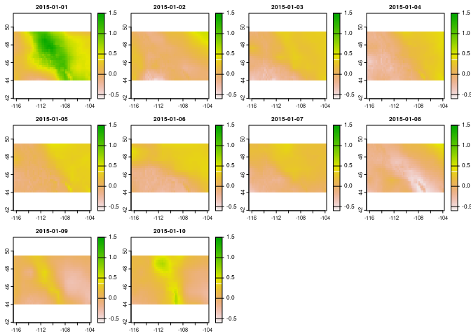

<!-- README.md is generated from README.Rmd. Please edit that file -->

# ETo: Daily Reference ET Calculations for Rasters

<!-- badges: start -->

[](https://github.com/mt-climate-office/ETo/actions/workflows/R-CMD-check.yaml)
[](https://github.com/mt-climate-office/ETo/actions/workflows/test-coverage.yaml)
<!-- badges: end -->

ETo provides basic utility functions for calculating point-based and
spatial daily reference ET. Currently, the Penman-Monteith and
Hargreaves methods are implemented. Functions are also provided to
calculate all necessary intermediate variables for calculating ETo. The
only input variables needed to calculate ETo are daily average
temperature, min temperature and max temperature (for Hargreaves), or
daily average temperature, relative humidity, solar radiation and
windspeed (for Penman-Monteith).

## Installation

You can install the development version of ETo from
[GitHub](https://github.com/) with:

``` r
# install.packages("devtools")
devtools::install_github("mt-climate-office/ETo")
```

## Example

Below, the [downscaled
CMIP6](https://www.nccs.nasa.gov/services/data-collections/land-based-products/nex-gddp-cmip6)
data for Montana that are provided with the package are used to
calculate and compare different ETo methods:

    #> Warning: [boundaries] boundary detection is only done for the first layer
    #> Mosaicing & Projecting
    #> Clipping DEM to bbox
    #> Note: Elevation units are in meters.


